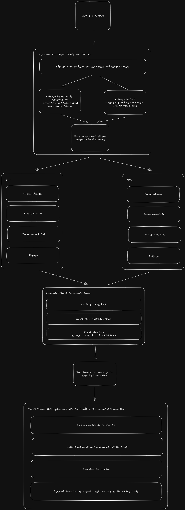
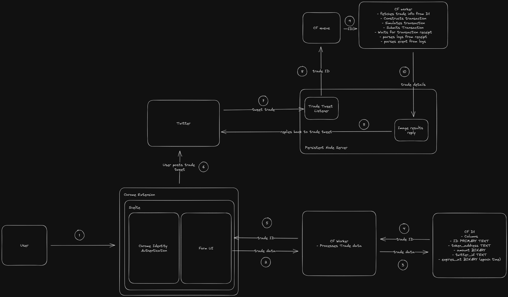
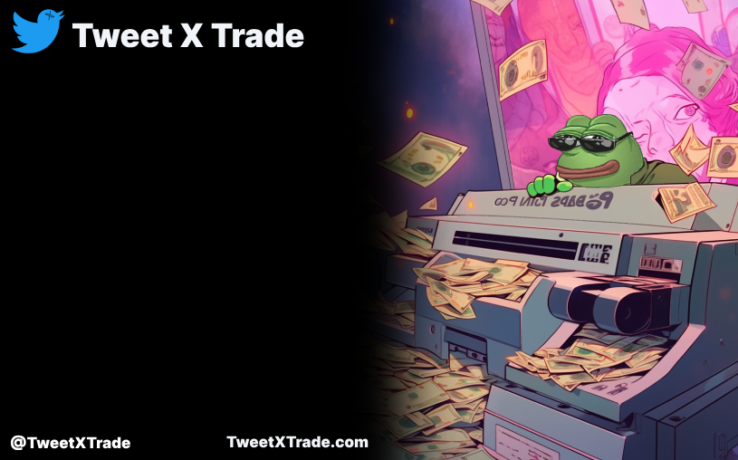
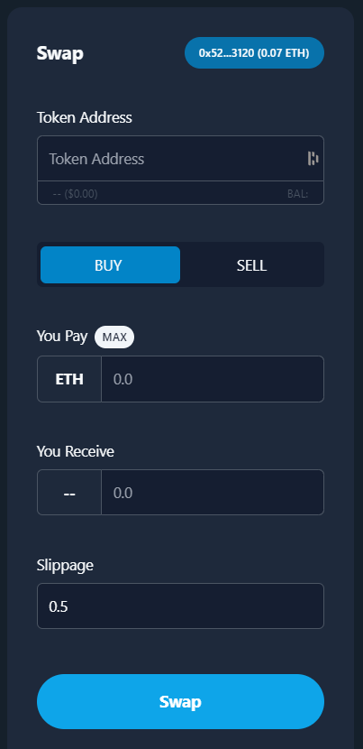

- After some research, there's not a great chance that Tweet Trader will get published on to the chrome store. So instead, I'm going to take this opportunity to open source the code and write a self reflection on how the development of Tweet Trader went

**Ideation Phase**

- The initial plan was to build an app where trades can only happen if the user tweets their position. Once a user tweets their position, the twitter bot would pick up on the tweet, execute the position on their behalf and reply back to the tweet with the position
- This creates a dynamic where people are forced to show their positions, effectively stopping anyone from being able to larp their positions

**Planning Phase**

**Architecture**

**Development Phase**

- The development was chunked up into 4 sections:
  - Authentication
  - Twitter bot to scrape for mentions and reply back to trade execution tweets with an image of the result of the trade
  - Server to execute trades based on tweeted trade executions
  - Chrome extension embedded into twitter for users to input details of the trade
- The plan was to start from the backend and work towards the frontend, starting with the authentication

**Authentication**

- The authentication needed for Tweet Trader consisted of 2 parts

  1.  3 legged auth from twitter to grab the access and refresh tokens to query for user info
  2.  generating a JWT for both the access and refresh tokens

- the goal of the 3 legged auth is to fetch the OAuth request token and OAuth verifier and use those to retrieve the users access tokens.

  The Oauth request token is fetched from twitters `request_token` endpoint. Then the OAuth verifier is fetched by using the OAuth request token to prompt the user to authorize the app (using chrome's identity api). Finally, the request token and verifier are passed through the `access_token` endpoint to fetch the users access tokens
  https://developer.twitter.com/en/docs/tutorials/authenticating-with-twitter-api-for-enterprise/oauth1-0a-and-user-access-tokens

- The goal of generating custom JWT access and refresh tokens for the user was to ensure that only they could execute functionalities on their hosted wallets.

  Once the user signed in with twitter, it first checked to see if the user already had an existing wallet. If they did not, a wallet was generated for them and stored in the cloudflare workers KV. Afterwards, the JWT tokens were generated using the wallet's private keys

**Twitter Bot**

- The goal of the twitter bot was to respond back to trade tweets with an image of the result of the trade. To accomplish this, it consisted of 4 parts:
  1.  Scrape for trade tweets
  2.  Send the info of the trade tweet to the server
  3.  Generate an image of the results of the trade returned back from the server
  4.  Respond back to the tweet with the results image

**Scraping the Tweets**

- Due to the cucking of Elon Musk on the twitter API, there were 2 ways of scraping mentions of the twitter bot
  1.  Eat the costs and use the twitter API to scrape for mentions
  2.  Develop a web scraper that looks for mentions of the twitter bot
      Since I'm not a fan of over committing to work, the plan was to use the twitter API first and then if it were to take off, transition to building a web scraper
- Using the /search twitter endpoint, searching for mentions of the twitter bot was straight forward, but looking for just mentions was not enough. The twitter bot should be searching for trade tweets that followed the proper structure.
- The trade structure needed to include a mention of the twitter bot, whether it was a buy or a sell, the token symbol and a unique identifier that was tagged to the trade to identify the correct details of the trade on the server
- After some deliberation, the following structure was formed `@TweetTrader BUY/SELL $TOKEN <UNIQUE_ID>`
- By creating this structure, this allowed for a more concise search query, which minimized the number of tweets that were scrapped and allowed for faster responses
- Once the tweet was scraped, it was put on a bullMQ messaging queue for a worker to pick up and further process

**Sending the info of the trade tweet to the server**

- Straight forward, since a unique identifier was already attached to the tweet, all that was needed was to parse for the unique identifier and ping the server endpoint with the unique ID
- Once the trade was processed, the server would send up the results of the trade back to the twitter bot for it create an image of the trade results

**Generating the image of the results**

- Using the canvas library for node, the following template images would be edited to have the token symbol, how much ETH was swapped and how much of the token was swapped
  
  

**Responding back to the trade tweet**

- Finally, using the `twitter-v2-api` library, the pictures would be uploaded using the `uploadMedia` method and then the `tweet` method would be used to reply back to the original trade tweet with the media ID fetched from `uploadMedia`

**Trade Execution Server**

- The goal of the trade execution server was to execute the trade based on the details of the trade tweet. This was accomplished through the following steps:
  1.  Fetch the trade details from the unique ID passed from the twitter bot
  2.  check to see if the trade is still valid
  3.  execute the trade
  4.  Pass up the results of the trade execution

**Fetching the trade details**

- The details of the trade would be stored on cloudflare D1 (not a great idea since it's in alpha still, but wanted to try it out anyways) and using the unique ID, the trade would be queried for on D1

**Validity check**

- Again, straightforward, based on the `expires_at` column from the trade info, it would be checked to see if it is before the current datetime. If it is, it is still valid, if not, it is considered invalid

**Executing the trade**

- This part requires grabbing the wallet, constructing the transaction for the trade, simulating the transaction and then submitting the transaction to Ethereum to execute the trade
- The wallet is fetched by using the users twitter ID to fetch for the wallet's private key from cloudflare KV.
- In order to construct the transaction for the trade the token pair address, amountIn and amoutnOutMin would be needed. The pair address would be fetched from the uniswap factory method from using the token address and the WETH address. The amountIn would be fetched from D1. The amountOutMin would be grabbed by fetching the token reserves and using the slippage to calculate the amountOutMin
- Then the transaction would be simulated to check if the transaction would fail without wasting ETH on gas
- Then finally the transaction would be submitted to Ethereum for it to be picked up

**Passing up the results of the trade execution**

- This part requires waiting for the transaction receipt, parsing for the event emitted from the logs in the transaction receipt and then sending the details of the emitted event to the twitter bot.
- the transaction receipt is waited for using viem's `waitForTransactionReceipt` method
- Then from the logs in the receipt, the corresponding `buy` or `sell` event is retrieved to get the final details of the trade
- Then the trade details from the event emitted is passed up to the twitter bot

**Chrome Extension UI**

- The goal of chrome extension is to allow users to input the details of the trade and retrieve back the message of the tweet trade for it to be processed. This is done through the following steps:
  1.  Embedding the chrome extension UI into the sidebar column of twitter
  2.  Creating a form component for users to input the details of the trade
  3.  Submitting the details of the trade for the Trade Execution server to process
  4.  constructing the trade tweet message for the user to post to execute

**Embedding the chrome extension UI**

- To accomplish this, the following [boilerplate template](https://github.com/NekitCorp/chrome-extension-svelte-typescript-boilerplate) was used and the `host_permissions`, `activeTab`, `identity`, `cookies` and `storage` permissions were required.
- `host_permissions`: This was to only run the chrome extension on twitter
- `activeTab`: To inject the trading UI on to twitter
- `identity`: To enable twitter signin
- `cookies`: To match the UI with the users current `nightMode` theme on twitter
- `storage`: To store the users access token, refresh token and twitter ID

- With the configurations out of the way, it was a matter of identifying which element was responsible for the side column and injecting the UI into that. Luckily, the element that was responsible for the side column had the attribute `data-testid=sideColumn`. With a simple the document.querySelector statement for the attribute, the element was retrieved. Unfortunately, since twitter is using React, not all of the elements are ready initially and are rendered in later. To overcome this, a mutation observer was needed in order to check whenever the sideColumn element is introduced on to the DOM

**Creating a form component**

- The form element comprised of 5 inputs:
  1.  Token address
  2.  Swap State (BUY or SELL)
  3.  Amount in
  4.  Amount Out
  5.  Slippage
- Without going into detail about constructing the UI, here is an image of the UI
  

**Submitting trade details to trade execution server**

- Once the details of the trade are inputted, they are sent to the trade execution server (a cloudflare worker) to store the details of the trade into D1 and to send the unique ID for that trade back to the chrome extension

**Constructing a trade tweet**

- Now with the unique trade ID, the message would be constructed in the following manner
  `@TweetTrader BUY/SELL $TOKEN <UNIQUE_ID>`

**Conclusion**

And there you have it, here are the details of how the Tweet Trader app was constructed (in theory). In reality, while most of the code was created and tested, was eventually scrapped due to some technical issues and constraints in terms of costs, so instead a simple version of the trading tool was created instead where it simply executes the transactions through metamask instead
